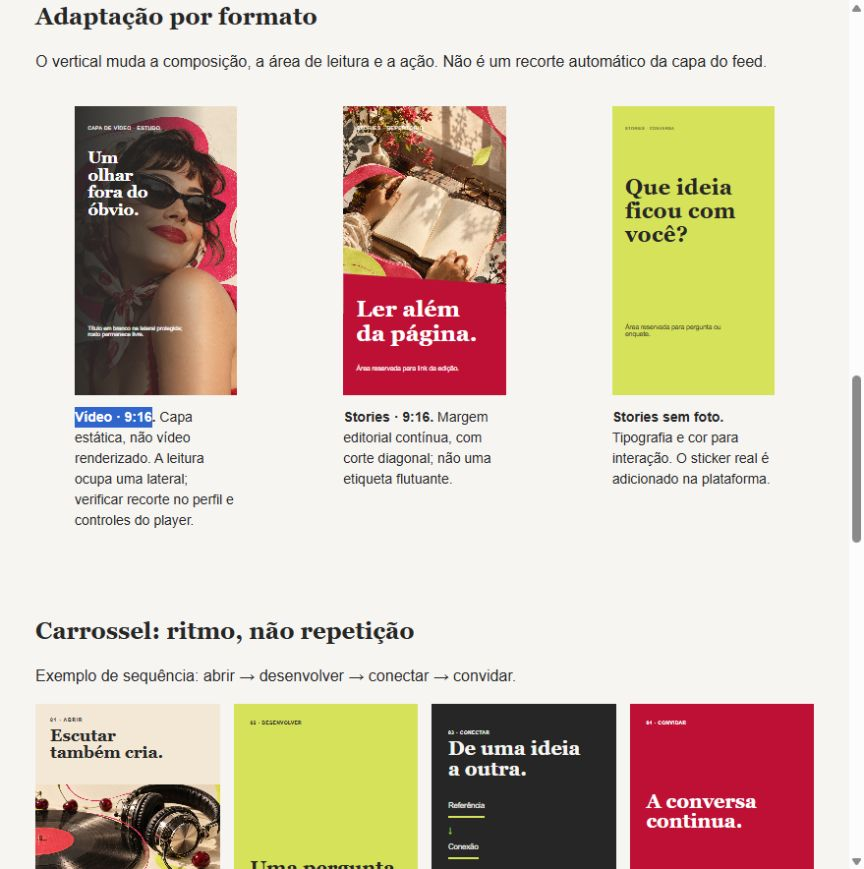
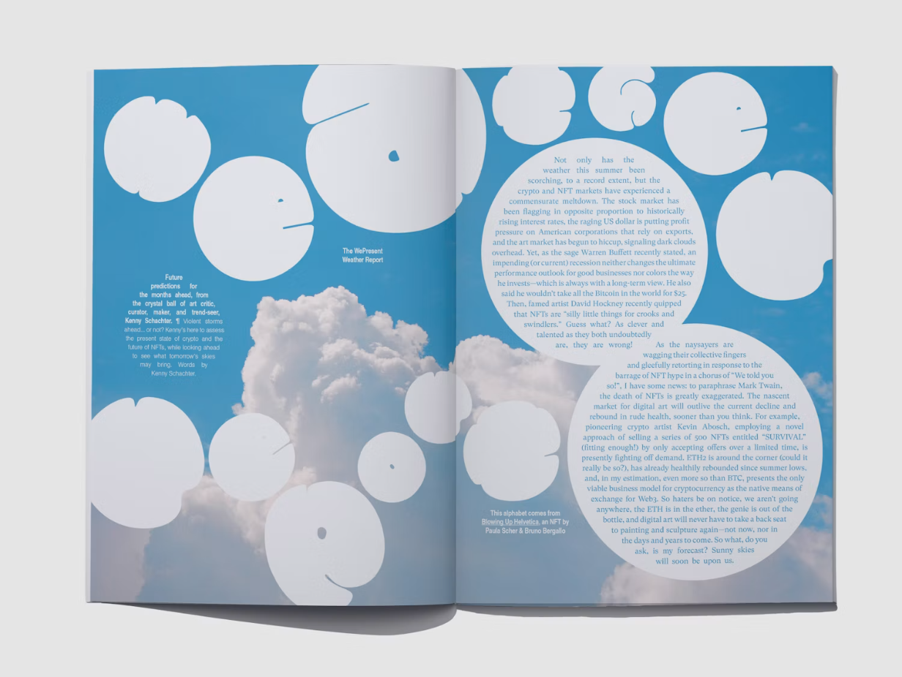
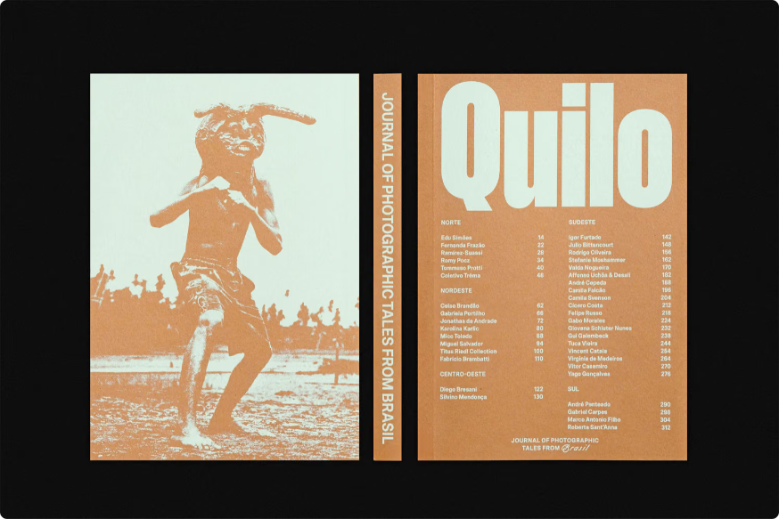
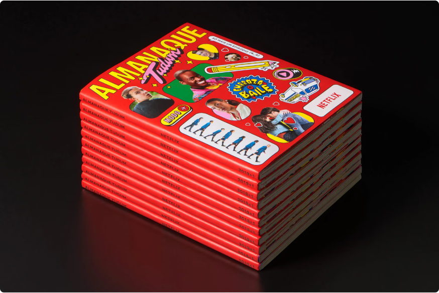
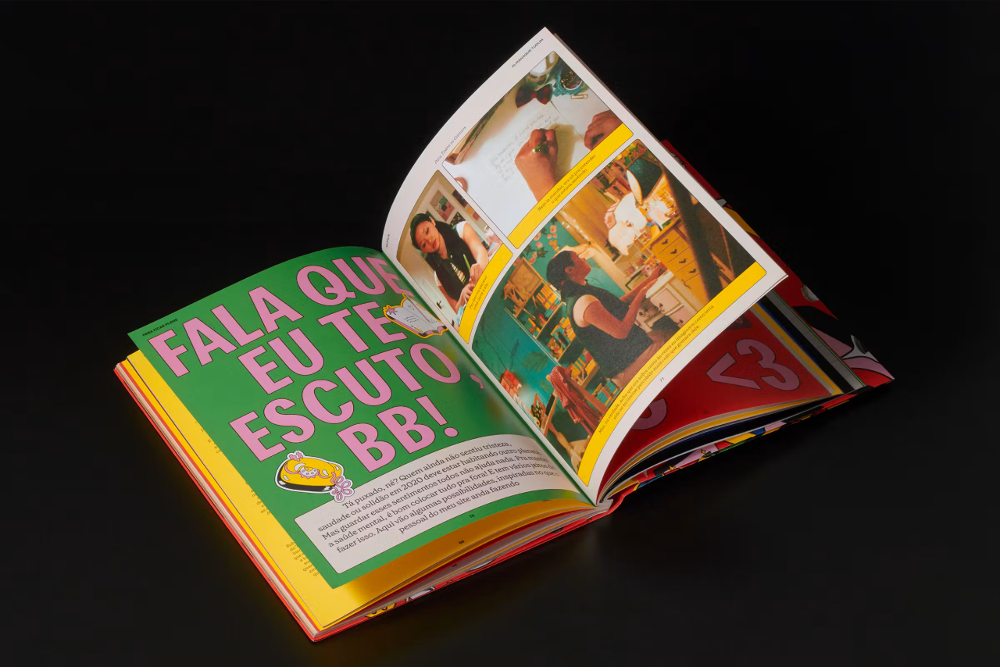
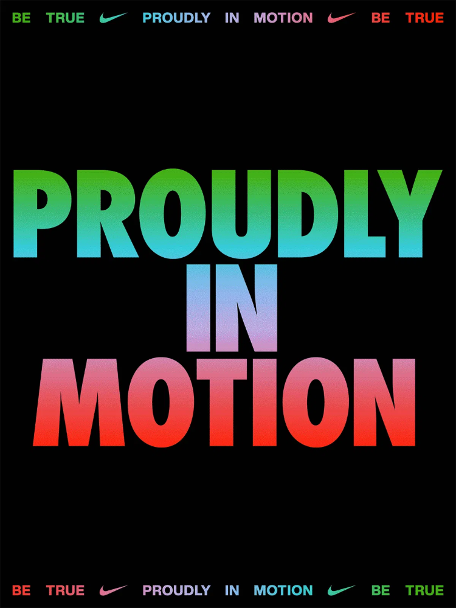
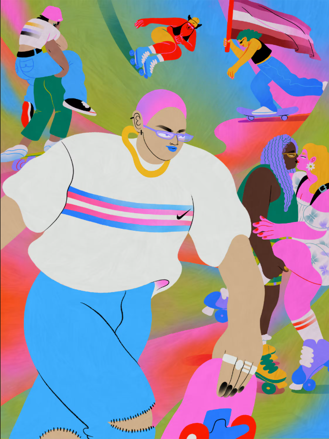
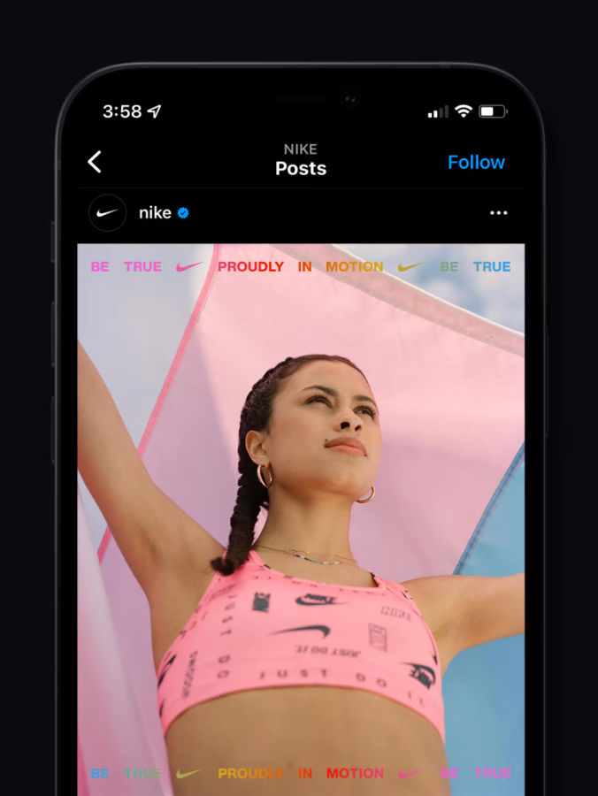

# #031 — Visual calibration pack

Data: 2026-10-06. **KELL — VISUAL CALIBRATION GATE: aguardando revisão. Não renderizar V3.**

Frame 1 vigente: **Eu li "Água em Marte" e pensei: batatas!** Alteração escrita por Kell nesta revisão. Os demais frames, história, fatos, legenda, cinco funções narrativas e ausência de CTA de assinatura permanecem aprovados.

## Diagnóstico visual

V2 ampliou a manchete, inclinou o documento e movimentou o objeto. Mas manteve leitura em faixas: abertura textual, imagem, crédito. As bordas poligonais não seguem informação ou matéria; a linha curva toca zonas, sem estabelecer uma relação necessária. O frame 4 tem foto grande, mas o comentário continua uma ficha separada. O frame 5 repete a distância entre pergunta, resposta e objeto. A sequência muda os fundos, sem construir uma passagem visual forte. Este é um diagnóstico de composição, não um novo parecer sobre copy.

PASS técnico e REVISE visual coexistem. Nenhuma afirmação anterior de “continuidade” no relatório V2 equivale à percepção ou aprovação de Kell.

## Referências internas: aprovação tem escopo

| Example | Status | What works | Visual principle | What not to copy | Applicability to #031 |
|---|---|---|---|---|---|
| Catálogo Flame v0.3, famílias e adaptações | approved visual reference, no escopo do registro de 04/10 | Capa musical reserva papel para título; cartaz lima tem poucas massas; fotografia e tipografia dividem o espaço | Escolher composição pela função e proteger leitura desde o início | Textos demonstrativos, assinatura em cada quadro, carrossel demonstrativo como template obrigatório | Referência positiva para capa, segunda capa e alternância; não aprova a V2 |
| Capa de newsletter #031 | approved visual reference; feedback de Kell no histórico: “amei a capa que vc criou” | Espiral de papel une livro, desenho e música; objetos se sobrepõem e saem do enquadramento | A matéria liga os assuntos dentro de uma cena, em vez de ilustrá-los em caixas | Reproduzir o livro, espiral, vinil ou densidade na história de Marte; capa de newsletter não usa texto | Referência de materialidade/ligação, não de layout social nem de fatos |
| Batata recortada e rabiscos das execuções atuais | approved visual reference apenas para elementos | Objeto comum dá humor e retorno; gesto colorido pode ligar elementos | Manter objeto e gesto, revisar sua relação | Deduzir que sua posição, tamanho ou curvas já foram aprovados | 1 e 5: retorno do objeto; linha com função local, não padrão de fundo |
| Feed Instagram atual | published baseline, conforme relato de Kell; sem aprovação estética presumida | Não extrair princípios positivos | Publicação não constitui validação visual | Aprender taste a partir de outputs operacionais do próprio sistema | Não usado para justificar nova direção |
| Montagens isoladas rock/journal e posts anteriores sem vínculo comprovado à aprovação | candidato interno, não canônico | Repertório a avaliar, sem extrair norma positiva | Exigir aprovação do exemplo concreto antes de promover | Atribuir aprovação ao asset por estar no mesmo diretório do catálogo | Não usados como autoridade nesta proposta |
| V1 e V2 #031 | anti-reference / learning artifact | Legibilidade e fatos sobrevivem; art direction reprovada | Usar para detectar empilhamento, grafismo dispensável e irregularidade sem propósito | Reaproveitar composição por ter passado QA | Comparação visual acima; não são base positiva |

Registro local de aprovação: [cópia preservada](031-visual-calibration/internal-approval-record.md). A aprovação de catálogo não é autorização para canonizar automaticamente todos os materiais do diretório. Busca interna limitada aos materiais locais disponíveis; não presumir que representa todo o arquivo histórico da Cereja.

## Quatro benchmarks externos para avaliação

Inspecionados no portfólio primário dos autores, não em agregadores. São **candidatos externos**, ainda não aprovados por Kell. Três são editoriais impressos; o quarto inclui aplicação social. A transposição de dobra/página para swipe é uma hipótese visual. Não há dado de conversão, prova de segunda entrega no Instagram ou aprovação estética da Cereja nestas fontes.

| Example | Status | What works | Visual principle | What not to copy | Applicability to #031 |
|---|---|---|---|---|---|
| [WePresent No. 5 · Paula Scher / Pentagram](https://www.pentagram.com/work/wepresent-no-5) | candidato externo | O cão recortado cobre palavras; o mapa conecta objetos específicos; nuvens e letras atravessam a dobra. | Sobreposição estabelece frente/fundo e vínculo sem precisar de uma caixa para cada elemento. | Densidade de mapa, letras deformadas, dezenas de fontes e imagem gerada como evidência. | 1: batata e manchete compartilham composição. 2: documento vinculado ao assunto. Continuidade 1→2 como hipótese, não cópia da dobra. |
| [QUILO · Mico Toledo / PORTO ROCHA](https://www.portorocha.com/quilo) | candidato externo | Retratos e paisagem ocupam alturas diferentes; um mapa amplo ocupa a dobra sobre fundo lima e quase não tem texto. | Mudança de escala e área vazia sinaliza mudança de assunto; a mesma publicação comporta foto, abertura e pausa. | Miniaturas de índice, corpo de livro reduzido, mapa como suposta visualização dos 185 alvos. | 2: segunda entrada independente por escala. 3: pausa tátil. 4: documento real com espaço proporcional ao seu papel. |
| [Almanaque Netflix Tudum · PORTO ROCHA](https://www.portorocha.com/netflix-tudum) | candidato externo | A capa liga recortes à linguagem de almanaque; nas páginas internas, foto e blocos tipográficos mudam de proporção. | A sequência reconhecível varia sua composição conforme o conteúdo; repertório cultural pode coexistir com leitura editorial. | Stickerização, maximalismo da capa, personagens, logos e imagens protegidas como assets da #031. | 1: objeto editorial inequívoco. 3→4: passar de interpretação cultural a fotografia documental sem repetir uma ficha. |
| [Nike Be True · PORTO ROCHA e colaboradores](https://www.portorocha.com/nikebetrue) | candidato externo | Tipografia muito grande e fotografia social dão entradas distintas; na ilustração, corpos e tecidos cortados continuam além das bordas. | Reconhecimento não exige repetir a mesma distribuição de texto e imagem; crop sugere um mundo maior que o quadro. | Slogan publicitário, gradiente arco-íris, marcas, moldura de aplicativo e corpo humano nos frames da #031. | 1 e 2 precisam de força própria. 5 reduz densidade. Usar apenas o princípio de escala/crop, sem importar o sistema Nike. |

### WePresent No. 5 · Paula Scher / Pentagram

Fonte e créditos: [WePresent No. 5 · Paula Scher / Pentagram](https://www.pentagram.com/work/wepresent-no-5). Leitura visual do assistente, proposta para avaliação.

### QUILO · Mico Toledo / PORTO ROCHA

Fonte e créditos: [QUILO · Mico Toledo / PORTO ROCHA](https://www.portorocha.com/quilo). Leitura visual do assistente, proposta para avaliação.

### Almanaque Netflix Tudum · PORTO ROCHA

Fonte e créditos: [Almanaque Netflix Tudum · PORTO ROCHA](https://www.portorocha.com/netflix-tudum). Leitura visual do assistente, proposta para avaliação.

### Nike Be True · PORTO ROCHA e colaboradores

Fonte e créditos: [Nike Be True · PORTO ROCHA e colaboradores](https://www.portorocha.com/nikebetrue). Leitura visual do assistente, proposta para avaliação.

## Sete princípios observáveis propostos

1. **Uma manchete, um objeto, uma relação.** Na capa, reconhecer “Água em Marte” antes do contexto; depois perceber a batata vinculada à reação. O objeto pode sobrepor uma área livre da manchete, nunca encobrir palavras essenciais. Base: catálogo e WePresent.
2. **Recorte acompanha matéria.** Batata conserva seu contorno real. Foto documental recebe crop retangular intencional; não acrescentar serrilha aleatória. Base: capa #031 e recortes WePresent/Tudum.
3. **Linha precisa de dois referentes ou um alvo claro.** Antes de desenhar, nomear o que ela sublinha, liga ou circunda. Se removê-la não muda ênfase ou percurso, removê-la definitivamente. Base positiva: gestos apreciados por Kell; conexão do mapa WePresent. A regra de remoção é uma proposta de avaliação.
4. **Segunda capa precisa sobreviver sozinha.** Ocultar frames 1/3 e verificar se “São águas passadas” domina, se Marte continua identificável e se a evidência é apoio. Não transformar a captura NASA numa terceira manchete concorrente. Base: aberturas QUILO e contraste tipográfico Be True; aplicação a segunda capa é hipótese.
5. **Continuidade exige coordenadas, não só intenção.** Em um par escolhido, um elemento que sai pela direita tem correspondência perceptível de posição, massa ou textura à esquerda seguinte. Verificar lado a lado e em swipe; não exigir linha literal nos quatro pares. Base: dobra WePresent e mapa QUILO.
6. **Documento muda o peso da sequência.** O frame 4 oferece a maior presença fotográfica documental; proteger bandejas, raízes e equipamento. Texto ancora uma zona livre ou margem ligada à foto. Não recortar a evidência principal para ganhar decoração. Base: contraste interno entre foto e abertura QUILO/Tudum.
7. **Fechamento tem menos massas, não mais distância.** Agrupar pergunta e resposta como conversa; reduzir elementos além da batata e convite. O vazio deve separar o conjunto da borda, não espalhar três textos sem vínculo. Base: cartaz Flame e alternância editorial QUILO. Sem assinatura gráfica.

## Aplicação proposta, antes de desenhar

| Frame | Mudança concreta proposta | O que testar na próxima execução, se aprovada |
|---|---|---|
| 1 | “Eu li” permanece ligado à frase, não isolado como etiqueta. “Água em Marte” domina. Batata invade um plano da composição, com contorno editorial evidente; terreno não vira chão de apoio do objeto | A manchete lidera sem apagar primeira pessoa. Ler a frase completa em ordem. Batata não parece descoberta marciana |
| 2 | Título com autonomia; a captura NASA passa a apoiar a correção em um conjunto, sem moldura irregular. Um vínculo visual com o 1, sem repetir o mesmo desenho | Ocultar o 1 e reconhecer assunto/correção. Não inventar mapa dos 185 pontos |
| 3 | Cultivo + abrigo como massa tátil principal; título e premissa próximos, entrando em área de respiro da composição | Pausa cultural reconhecível, sem pessoa, pôster, panorama ou batata extra |
| 4 | A fotografia de cultivo terrestre governa o enquadramento. Copy conversa com a área livre/margem da foto. Crédito permanece legível, sem footer padronizado | Reconhecer experimento terrestre e elementos de cultivo antes de ler empresa. Sem sobreposição que esconda bandejas/raízes |
| 5 | Pergunta e resposta têm relação próxima; retorno da batata orienta o fechamento; convite secundário ligado ao conjunto | Respiro deliberado, leitura contínua e circularidade. Sem marca, novo CTA ou adereço |

São mudanças de composição propostas para calibração, não uma nova história ou copy. Não são wireframes, assets selecionados nem autorização de V3.

## Registro e limites

- Copy 1 escrita por Kell: **Eu li "Água em Marte" e pensei: batatas!**. Nenhuma redação anterior recebe autoria retroativa.
- [Legenda revisada preservada](031-visual-calibration/caption-preserved.txt): sem URLs cruas ou handles não verificados. URLs científicas completas continuam no handoff/provenance de produção. Não acrescentar CTA de assinatura.
- Referências externas são screenshots para revisão, com autoria e links. Não são biblioteca de assets, autorização de reutilização nas artes ou prova de eficácia comercial. Capturas de GIF são amostras estáticas, não avaliação de motion.
- [Capturas e URLs de origem](031-visual-calibration/reference-captures.json). Algumas miniaturas limitam avaliação de microtipografia; não extrapolar legibilidade no celular a partir delas.
- Proposta de aprendizado a validar: **Visual canon = princípios + exemplos aprovados + anti-exemplos.** Não incorporada a skills ou Núcleo nesta tarefa.
- Nenhuma V3 renderizada. V1/V2 preservadas como histórico, inclusive sua copy anterior. A página deste pack é apenas uma apresentação de referências existentes.

**Parada: KELL — VISUAL CALIBRATION GATE.** Aprovação de referências/princípios vem antes da próxima execução.
