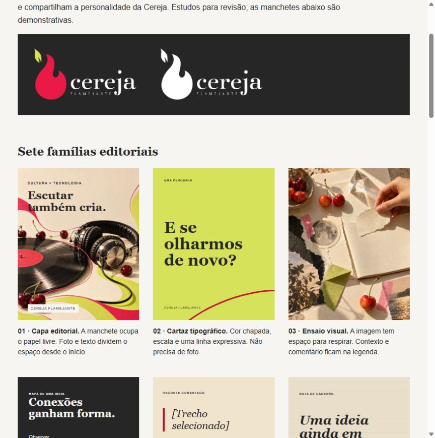
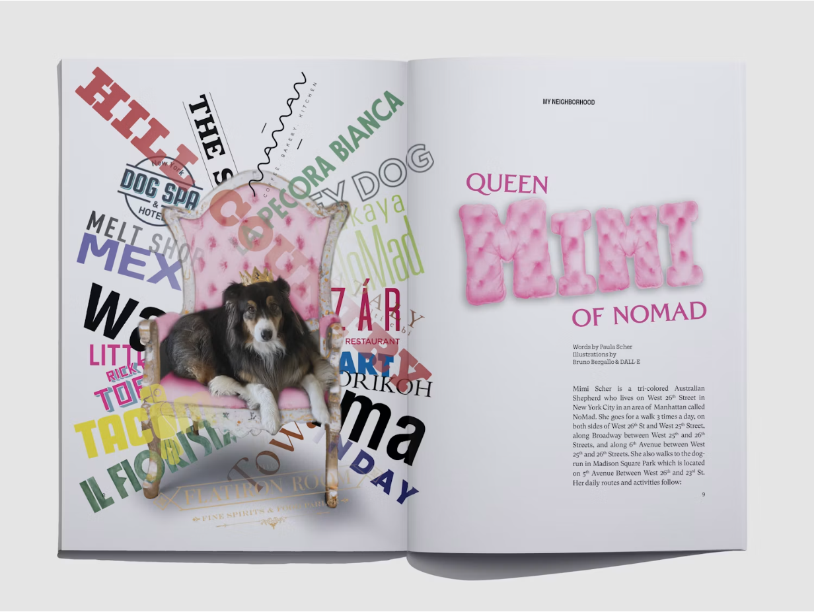
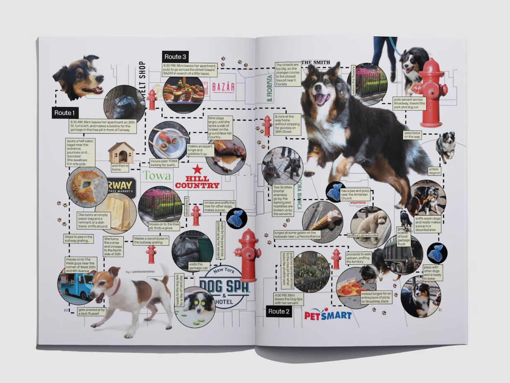
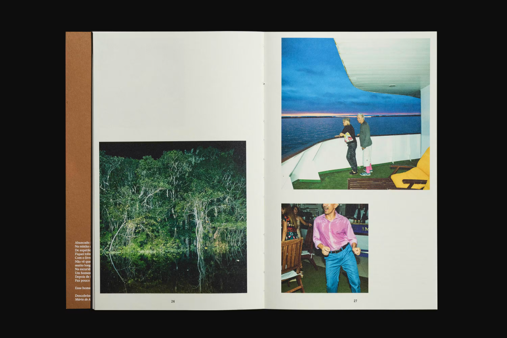
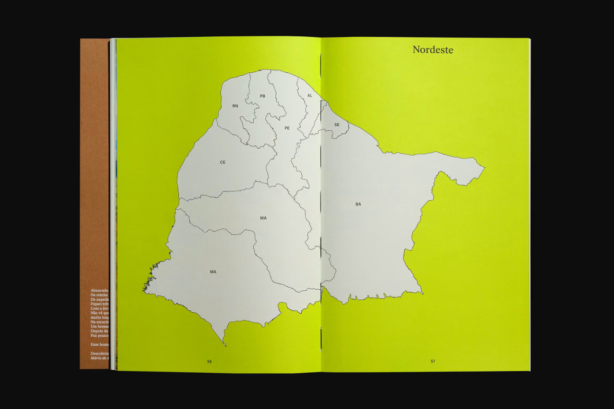
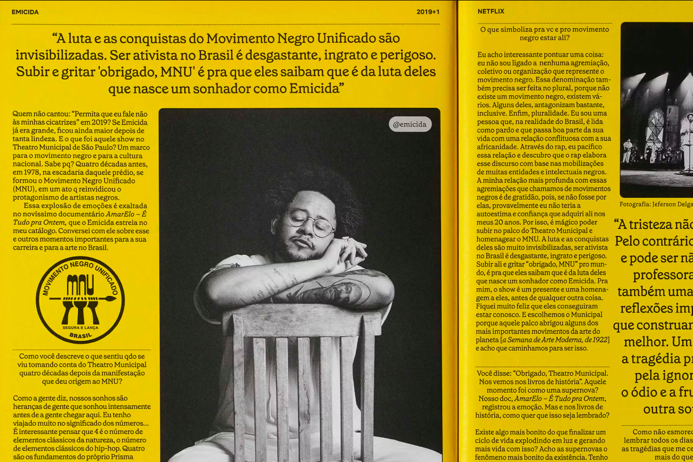
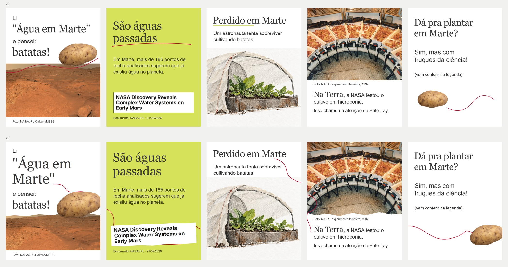

# #031 · Visual Calibration Pack consolidado

**KELL — VISUAL CALIBRATION GATE: aguardando aprovação. Não produzir V3.**

Data: 2026-10-06. Copy vigente do frame 1: **Eu li "Água em Marte" e pensei: batatas!**. História, cinco frames, copy dos demais frames, fatos, direção narrativa, legenda revisada e ausência de CTA de assinatura preservados.

## Origem da seleção e limites

**10 entradas: oito exemplos visuais concretos e duas coleções escolhidas por Kell.** As coleções são fontes de repertório, não dois pins já examinados. V1/V2 constituem uma entrada comparativa, com diagnóstico separado por versão. O elogio de Kell ao conjunto não foi convertido em aprovação individual de todos os candidatos.

- `user-selected reference`: seleção trazida por Kell; não é aprovação automática de cada item de uma coleção.
- `system-discovered candidate`: descoberta do Codex, mantida para expandir repertório; aguarda decisão deste gate.
- `approved visual reference`: decisão explícita anterior de Kell, com escopo e registro identificados.
- `anti-reference`: exemplo rejeitado visualmente que ajuda a avaliar a próxima composição.

Pinterest: ambas as páginas carregaram no navegador, mas o login cobre a galeria e impede inspeção completa dos pins. O 403 anterior de Bruna era do leitor web, não prova de coleção indisponível. Não inferir autoria dos trabalhos pelo nome do curador. [Registro de acesso](031-visual-calibration/user-collections-access.json).

Não avaliar eficácia comercial a partir do portfólio. Dobra impressa e composição de feed não comprovam continuidade de carrossel; sua aplicação ao swipe é hipótese a testar. Referências externas são estudo, não assets liberados para publicação.

## Seleção enxuta

| Exemplo | Provenance de seleção | O que ensina | Limite / o que não copiar | Aplicação à #031 |
|---|---|---|---|---|
| [U1 · Instagram references · Rodolfo Salles](https://br.pinterest.com/rodolfosalles/instagram-references/) | `user-selected reference` · Kell | Coleção de descoberta para layout social; selecionar exemplos pela relação entre texto, fotografia e sequência. | A tela de login cobre a galeria pública. Nenhum pin individual ou sequência completa validado. Não derivar uma norma visual das miniaturas. | Ampliar repertório social dos frames 1/2 e transições, quando houver exemplos acessíveis. |
| [U2 · Referências visuais Instagram · Bruna Silva](https://br.pinterest.com/brunahasilva/refer%C3%AAncias-visuais-instagram/) | `user-selected reference` · Kell | Coleção escolhida por Kell para investigar identidade, gesto, composição e integração tipográfica. | O leitor web retornou 403; navegador carregou o board com login sobreposto. Autores dos pins não identificados. Não atribuir os trabalhos à curadora. | Investigar composições sociais, sem substituir os exemplos concretos abaixo por uma coleção não examinada integralmente. |
| [A1 · Flame v0.3 · capa musical e cartaz lima](031-visual-calibration/internal-approval-record.md) | `approved visual reference` · Kell, no escopo do catálogo | Foto e título dividem uma área planejada. O cartaz muda a densidade sem perder a paleta e a presença tipográfica. | Aprovação do catálogo não aprova toda arte no diretório. Não copiar metadados, textos demonstrativos ou estrutura de convite para cada frame. | 1/2 com força própria; unidade pode sobreviver a distribuições muito diferentes. |
| [A2 · Capa da newsletter #031 · espiral, livro e vinil](031-visual-calibration/internal-cover-031.png) | `approved visual reference` · Kell | A espiral reúne assuntos; sombra, papel e sobreposição fazem parte de uma mesma cena. As bordas cortam objetos com propósito. | Não levar livro, vinil ou espiral para Marte. Capa de newsletter não usa texto; este exemplo não resolve tipografia. | 1/3/5: matéria e objetos constroem vínculo; não adicionar itens só para sinalizar colagem. |
| [S1 · WePresent No. 5 · abertura Queen Mimi](https://www.pentagram.com/work/wepresent-no-5) | `system-discovered candidate` · Codex | O objeto encobre parte do campo tipográfico, criando frente e fundo; o título do outro lado oferece uma segunda entrada. | Não copiar densidade, lettering, cadeira ou cão. O projeto informa uso de imagem gerada; não importar isso como documento científico. | 1: a batata conversa com a manchete em um plano editorial, sem parecer instalada no terreno. |
| [S2 · WePresent No. 5 · mapa do passeio](https://www.pentagram.com/work/wepresent-no-5) | `system-discovered candidate` · Codex | Percurso e recortes ligam lugares identificáveis. O gesto gráfico tem referentes e conta o trajeto. | Não copiar mapa, setas, caixas ou densidade. Não é evidência de conversão, nem modelo de carrossel científico. | 1→2 ou 4→5: linha/forma precisa ligar um pensamento a um objeto; não decorar todas as bordas. |
| [S3 · QUILO · dupla fotográfica assimétrica](https://www.portorocha.com/quilo) | `system-discovered candidate` · Codex | Uma foto baixa à esquerda contrapõe duas à direita. O vazio superior altera ritmo e a diferença de escala organiza leitura. | Não copiar página de livro, fotografias ou corpo minúsculo. Vazio não é licença para afastar textos que formam uma frase. | 3/4: pausa e documento ganham composições distintas, sem foto obrigatoriamente abaixo de um bloco de título. |
| [S4 · QUILO · abertura Nordeste em lima](https://www.portorocha.com/quilo) | `system-discovered candidate` · Codex | Uma massa dominante atravessa a dobra; quase nenhum texto disputa com ela. A abertura funciona como entrada independente. | Não desenhar mapa dos 185 alvos nem importar uma cor sem função. Dobra impressa não comprova comportamento de swipe. | 2: entrada autônoma por título e massa visual. Continuidade lateral deve ser testada, não apenas descrita. |
| [S5 · Almanaque Tudum · retrato documental em página amarela](https://www.portorocha.com/netflix-tudum) | `system-discovered candidate` · Codex | Foto central e comentário ocupam um campo editorial compartilhado. Mudanças de escala tipográfica ancoram a imagem. | Não copiar colunas, densidade de almanaque, retrato ou marca. A #031 precisa continuar legível no celular. | 4: imagem NASA governa a composição; texto e crédito se relacionam com suas zonas livres, sem virar uma ficha separada. |
| [X1 · #031 · comparação V1/V2](031-visual-calibration/anti-v1-v2.jpg) | `anti-reference` · Kell, como rejeição visual | V1 empilha título, comentário, foto e crédito. V2 muda escala e bordas, mas conserva a separação. Rabiscos continuam dispensáveis para a leitura. | Preservar legibilidade, fatos, batata e possibilidade de gesto; não reutilizar posições ou polígono irregular como solução aprovada. | Todos: avaliar relações e sequência, não contar quantos elementos Flame foram adicionados. |

**Redundâncias retiradas da seleção principal:** Nike Be True (escala/crop já demonstrados de modo mais pertinente por A1/S1/S4); capas, índices e Weather Report adicionais (mais imagens para as mesmas lições). Permanecem registrados como descobertas, sem rejeição atribuída a Kell. A seleção não foi reduzida apenas ao que Kell trouxe.

## Exemplos e evidência de seleção

### U1 · Instagram references · Rodolfo Salles

`user-selected reference`. URL fornecida por Kell e coleção elogiada por ela.

Coleção mantida por seleção de Kell. Não apresentar a tela de login como referência visual positiva.

### U2 · Referências visuais Instagram · Bruna Silva

`user-selected reference`. URL fornecida por Kell e coleção elogiada por ela.

Coleção mantida por seleção de Kell. Não apresentar a tela de login como referência visual positiva.

### A1 · Flame v0.3 · capa musical e cartaz lima

`approved visual reference`. Registro de aprovação de 04/10 preservado; capa editorial e famílias por função.

### A2 · Capa da newsletter #031 · espiral, livro e vinil

`approved visual reference`. Feedback explícito no histórico: “amei a capa que vc criou”. Aprovação de imagem, não de layout social.

### S1 · WePresent No. 5 · abertura Queen Mimi

`system-discovered candidate`. Galeria primária Pentagram / Paula Scher, inspecionada. Kell reconhece afinidade do conjunto; sem aprovação individual deste exemplo.

### S2 · WePresent No. 5 · mapa do passeio

`system-discovered candidate`. Galeria primária Pentagram / Paula Scher, inspecionada.

### S3 · QUILO · dupla fotográfica assimétrica

`system-discovered candidate`. Galeria PORTO ROCHA; publicação de Mico Toledo. Imagem original inspecionada.

### S4 · QUILO · abertura Nordeste em lima

`system-discovered candidate`. Galeria primária PORTO ROCHA, inspecionada.

### S5 · Almanaque Tudum · retrato documental em página amarela

`system-discovered candidate`. Galeria primária PORTO ROCHA / Netflix Tudum, inspecionada.

### X1 · #031 · comparação V1/V2

`anti-reference`. Kell reprovou V1/V2 visualmente. PASS técnico não constitui aprovação de direção de arte.

## Diagnóstico específico das anti-referências

**V1:** blocos separados de abertura, foto e crédito; recorte da batata flutua como ilustração. O frame documental tem peso fotográfico, mas comentário se comporta como ficha abaixo dele. O 5 dispersa pergunta, resposta, convite e objeto.

**V2:** maior manchete e objeto parcialmente fora do canvas; continua isolando “Li” e empilhando os demais blocos. O clip-path inventa matéria sem motivo. Rabiscos mudam de curva, mas a relação entre conteúdo e gesto permanece fraca. Saídas de borda não produzem correspondência perceptiva suficiente no próximo frame.

**Lição comum:** a unidade está na relação entre as partes, não no número de efeitos implementados. CSS pode executar direção de arte; não deve decidir automaticamente serrilha, inclinação, empilhamento ou sombra. PASS técnico não supera REVISE visual. Legibilidade e elementos apreciados permanecem, posições não estão aprovadas.

## Sete princípios observáveis propostos

### P1 · Relação antes de adereço

Identificar o elemento dominante e o elemento que reage a ele. Proximidade, escala ou sobreposição deve tornar o vínculo visível antes de qualquer rabisco.

Base: A1, A2, S1; contraste com X1. **Verificação:** Ao esconder o grafismo, o conjunto ainda conta algo? Ao escondê-lo novamente depois da intervenção, o gesto acrescentava uma ênfase específica?

### P2 · Recorte com motivo

O recorte acompanha um contorno, uma borda material ou uma decisão de enquadramento. Recortar documento não pode apagar evidência.

Base: A2, S1; limite aprendido em X1. **Verificação:** Explicar por que cada borda existe. Uma serrilha sem motivo é removida; não é necessário irregularizar toda foto.

### P3 · Tipografia ocupa a imagem com cuidado

Texto usa área livre, entra numa margem da fotografia ou compartilha um plano com o objeto. Sobreposição deve proteger palavras essenciais e informação documental.

Base: A1, S1, S5. **Verificação:** Ler em celular; reconhecer objeto e texto como conjunto. Não resolver conflito diminuindo fonte.

### P4 · Gesto com referente

Uma linha sublinha uma palavra, circunda uma pista ou liga dois elementos nomeáveis. Seu começo/fim responde à composição.

Base: Elemento apreciado por Kell, S2; anti-exemplo X1. **Verificação:** Dizer o verbo da intervenção e seu alvo. Se não houver alvo ou mudança perceptiva, retirar.

### P5 · Segunda entrada autônoma

O frame 2 mantém reconhecimento do assunto, mas muda a perspectiva e o peso visual. Título e evidência não concorrem como duas manchetes.

Base: A1, S4; hipótese de transposição para o Instagram. **Verificação:** Ver o 2 sozinho: assunto identificável, correção compreensível e vontade de continuar. Não copiar um mapa para fingir evidência.

### P6 · Continuidade que revela

Uma saída pela borda pode corresponder a posição, massa, cor, matéria ou revelação no próximo frame. Também pode haver uma pausa entre dois movimentos.

Base: S2, S3, S4; desejo de continuidade expresso por Kell. **Verificação:** Examinar pares em swipe: existe relação percebida, além de uma frase no relatório? Não repetir uma curva nos quatro pares.

### P7 · Ritmo sem ficha repetida

Alternar massa tipográfica, recorte editorial, pausa tátil e documento dominante. Unificar pelo tratamento e pelas relações, não por cabeçalho/rodapé fixos.

Base: A1, S3, S4, S5; contraste com X1. **Verificação:** As cinco silhuetas diferem? O documento pesa mais no 4 e o 5 reduz massas sem dispersar pergunta/resposta?

## Como isso alteraria os cinco frames, se aprovado

| Frame / job preservado | Diagnóstico | Alteração de composição proposta | Relação e critério de leitura |
|---|---|---|---|
| 1 · reação/capa | Palavra introdutória isolada e três faixas; batata como acessório | “Eu li” fica ligado à frase. “Água em Marte” domina um conjunto com reação e batata editorial. Objeto ocupa uma passagem entre planos, sem encobrir letras nem simular instalação no terreno | P1/P2/P3. Reconhecer manchete e depois a associação; ainda ler a frase integral em ordem |
| 2 · correção/segunda capa | Título, explicação e captura NASA disputam como blocos | “São águas passadas” tem presença autônoma. Documento e texto factual formam apoio ligado à correção, com crop pelo conteúdo. Testar uma relação de massa/posição com o 1 | P3/P5/P6. Ver o 2 sozinho e compreender Marte/passado. Não inventar visualização dos 185 pontos |
| 3 · pausa cultural | Ilustração fica abaixo de duas linhas como resposta pronta | Cultivo + abrigo vira uma massa tátil com área livre para título/premissa. O encaixe responde aos materiais, sem acrescentar pessoa, panorama, pôster, batata ou prop novo | P2/P3/P7. A pausa se percebe pela silhueta e matéria, sem sacrificar texto ou parecer still |
| 4 · descoberta documental | Foto grande, seguida de ficha separada e gesto lateral dispensável | Crop preserva raízes, bandejas e equipamento. Copy ancora uma zona livre ou margem diretamente relacionada à foto. Crédito acompanha o documento sem footer fixo | P1/P3/P4/P7. Experimento terrestre domina antes de empresa; Frito-Lay segue subordinada |
| 5 · retorno/fechamento | Distâncias quebram a conversa e linha não acrescenta relação | Pergunta e resposta próximas como conjunto; batata retorna em escala/posição escolhidas para responder à abertura. Convite para legenda secundário. Vazio em torno da conversa, sem marca gráfica | P1/P4/P6/P7. Circularidade percebida sem gimmick, adereço ou CTA novo |

Esta é a hipótese de calibração, não execução, wireframe ou autorização de V3. Não fixa coordenadas, todos os crops, tamanho de fonte ou um único gesto antes da composição. Mantém jobs e copy aprovados.

## Taste Layer como processo de direção de arte

[Camadas separadas: moodboard, territórios, fingerprint e anti-taste](031-visual-calibration/taste-layer.md). O moodboard vincula exemplos a decisões concretas. Os territórios são vocabulário de empréstimos parciais, sustentados por referências aprovadas quando disponíveis e com candidatos claramente separados. Colagem editorial, Pop editorial/cartaz, surrealismo de associação, caderno/zine como hipótese lateral e editorial fotográfico com respiro não classificam a Cereja integralmente em nenhuma escola. Nenhuma fonte histórica adicional virou exemplo visual ou aprovação.

## Taste Fingerprint provisório da Cereja Flamejante

[Síntese completa, com evidência, confiança e espaço de variação](031-visual-calibration/taste-fingerprint.md).

O conjunto sugere uma gramática de **presença editorial, encontro entre materiais e surpresa por associação**. Tipo, foto e recorte podem compartilhar o campo. O gesto marca uma atenção; textura tem matéria; assimetria equilibra massas diferentes. Densidade e silêncio convivem. Humor pode surgir de um objeto cotidiano tratado com cuidado visual.

Essa leitura extrapola a #031 como hipótese de identidade, conforme observação de Kell. Não converte imagens em um template. Tensão pode existir sem colagem, cor chapada pode dispensar foto, composição central pode funcionar e linha pode faltar. O recorrente são relações e decisões, não efeitos obrigatórios.

Destoam: empilhamento indiferente ao assunto; rodapé carimbado; cards com pesos iguais; irregularidade randômica como atalho para mão humana; documento reduzido a decoração; stickerização e acabamento genérico de apresentação. Esses limites combinam a rejeição V1/V2 e o Flame; não rejeitam todo trabalho dos autores usados como candidatos.

## Registros e parada

- [Provenance de seleção por entrada](031-visual-calibration/selection-provenance.json), com responsável, evidência e escopo. Aprovação de Kell não muda retroativamente quem descobriu o exemplo.
- [Capturas e URLs originais](031-visual-calibration/reference-captures.json); autores/curadores não são confundidos.
- [Legenda revisada preservada](031-visual-calibration/caption-preserved.txt), sem URLs públicas cruas, handles não verificados ou CTA de assinatura. URLs científicas completas permanecem no handoff/provenance de produção.
- Nenhuma skill, fonte canônica de marca ou arte V1/V2 alterada nesta consolidação. Não promove assets exploratórios a finais.
- Proposta a validar: **Visual canon = princípios + exemplos aprovados + anti-exemplos**. Fingerprint continua provisório e contextual.

**Parada: KELL — VISUAL CALIBRATION GATE. Nenhuma V3 produzida, publicada ou agendada.**
